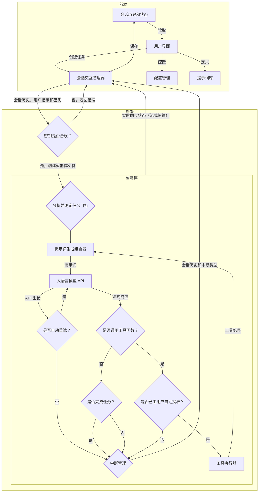
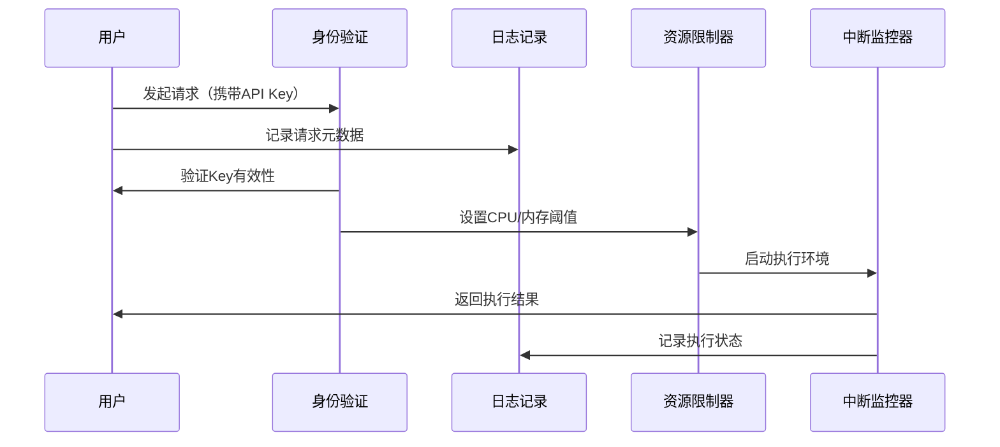

# 项目架构

yaa 智能体是前后端分离的，前端使用 HTML + CSS + JS，后端使用 Python。

> 目前项目正在开发中，开发者可以参考 [OpenManus 的智能体框架架构图](openManus.md)和 [Roo Code 的工作流程图](RooCode.md)。

## 构思

### 前端

提供用户界面，存储会话历史、存储配置、存储提示词。

### 后端

智能体实现、工具使用（函数调用）实现、运行会话、缺省时提供默认配置、缺省时提供默认提示词。

### 整体架构图



### 工具调用安全机制



<!-- ### 后端代码结构

```mermaid
%% yaa 后端代码结构图
classDiagram
    class BaseAgent {
        
    }
``` -->
