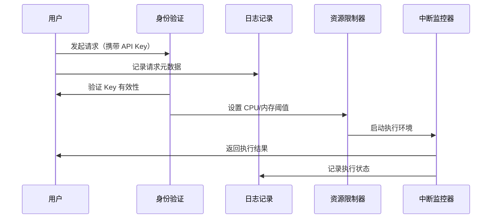
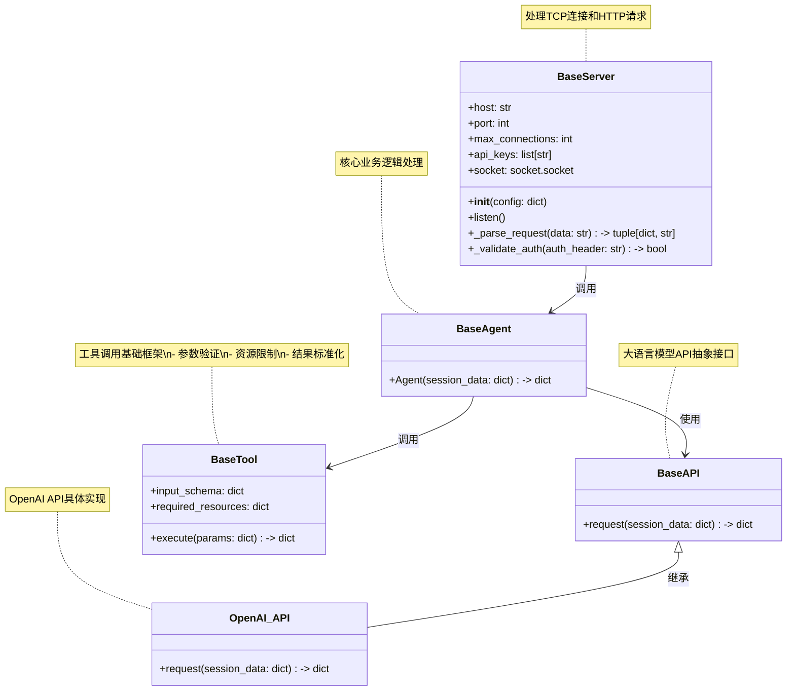
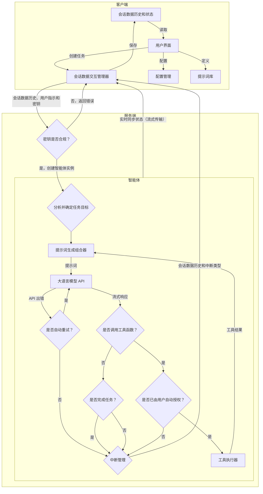

# 项目架构

yaa 智能体采用服务端、客户端结构，服务端使用 Python，客户端使用 HTML + CSS + JS。

## 实现

### 客户端

1. 提供用户界面
2. 管理会话数据
3. 存储会话数据历史、存储配置、存储提示词。

### 服务端

1. 智能体实现
2. 工具使用（函数调用）实现
3. 当会话数据中缺省时提供默认配置和默认提示词。
4. 解析会话数据将信息交给大模型生成回答，再根据大模型的回答调用工具

#### 工具调用安全机制



#### 服务端代码结构



### 整体架构图

用户在客户端输入指示或对会话数据进行修改后，客户端将当前会话数据通过 API 发送至服务端；
服务端在验证密钥通过后，将会话数据中缺省的配置和缺省的预设提示词补全后传入新建的智能体实例；
智能体实例根据指示或对会话数据进行修改后，将修改后的会话数据返回给客户端；



### 数据结构

#### 会话数据

会话数据由客户端生成并发送至服务端。

会话数据主要包含三个部分：

- 属性：
  - 编号：用于唯一标识会话数据，在客户端使用 uuid 生成。
  - 标题（可选，缺省值由大模型根据消息内容配合提示词生成）：用于向用户展示会话数据的主题。
  - 开始时间（可选，缺省值取当前格林尼治时间）：记录会话数据的开始时间。
  - 智能体人格：如`您是 yaa，一个智能体。`等。
  - 状态：记录会话数据的状态，如`进行中`、`已中断`、`已完成`。
- 消息：一般包含智能体消息、系统错误消息、用户发送的消息、大模型的回复消息等。
  - 角色：如`智能体`、`用户`、`系统`等。
  - 内容：消息的内容。
- 配置（可选，缺省值使用默认配置）：包含 yaa 的配置信息（如覆盖系统默认提示词、最大上下文长度等软件设置）和大模型的配置信息（如 API、密钥、名称、模型参数）等。
  - 提示词：如函数调用的提示词模板、系统信息的提示词模板等。

```json
{
    "id": "string",
    "title": "string",
    "start_time": "string",
    "character": "string",
    "status": "string",
    "messages": [
        {
            "role": "string",
            "content": "string"
        },
        {
            "role": "string",
            "content": "string"
        }
    ],
    "config": {
        "yaa" : {
            "stream": "bool",
            "language": "string"
        },
        "llm_api": {
            "provider": {
                "api_url": "string",
                "api_key": "string",
                "model_name": "string",
                "model_type": {
                    "is_function_call": "bool",
                    "is_reasoning": "bool"
                },
                "cost_per_ktoken": "float",
                "cost_unit": "string",
                "max_tokens": "int",
                "model_settings": {
                    "use_costum_temp": "bool",
                    "temperature": "float"
                },
            },
            "stream": "bool",
            "request_timeout": "int",
            "interval": "int",
            "retry": {
                "times": "int",
                "delay": "int"
            }
        },
        "prompt": {
            "todo": "todo"
        },
        "tool": {
            "base_tool": {
                "auto_approve": true
            },
            "finish": {
                "auto_approve": true
            }
        }
    }
}
```

#### 智能体回复数据

智能体回复数据由 yaa 解析会话数据并执行生成结果后发送至客户端。

智能体回复数据主要包含两个部分：

- 属性：
  - 编号：用于唯一标识会话数据。
  - 标题（可选，如果和发送过来的会话数据相同，则取发送过来的会话数据标题）：用于向用户展示会话数据的主题。
  - 开始时间：记录会话数据的开始时间。
  - 智能体回复数据中断（结束）原因：如`完成`、`等待反馈`、`失败`等。
- 消息：一般包含智能体消息、系统错误消息、用户发送的消息、大模型的回复消息等。
  - 角色：如`智能体`、`系统`等。
  - 内容：消息的内容。
- 用量：如大模型的用量。

```json
{
    "id": "string",
    "title": "string",
    "start_time": "string",
    "finish_reason": "string",
    "messages": [
        {
            "role": "string",
            "content": "string"
        }
    ],
    "usage": {
        "prompt_tokens": "int",
        "completion_tokens": "int",
        "total_tokens": "int"
    }
}
```

## 流程分析

- [最基本流程分析](FlowAnalyze/BaseFlowAnalyze.md)
- [流程分析](FlowAnalyze/FlowAnalyze.md)
