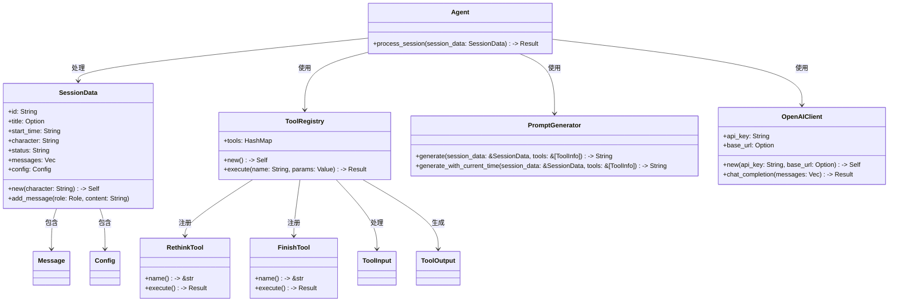
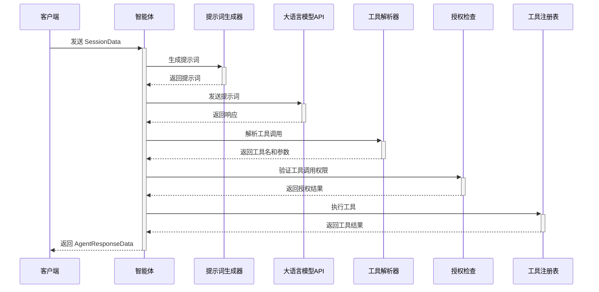

# 项目架构

yaa 智能体采用 Rust 实现，支持 WASM（WebAssembly）和 WASI 运行时环境，可作为服务器模式或命令行交互模式运行，也可编译为 WASM 被 HTML 调用。

## 实现

### 核心功能

1. 会话数据管理 (SessionData)
2. 工具调用框架 (ToolRegistry)
3. 提示词生成器 (PromptGenerator)
4. 大语言模型 API 集成 (OpenAIClient)
5. 智能体核心逻辑 (process_session)
6. 工具实现：
   - 再度思考工具 (RethinkTool)
   - 完成会话工具 (FinishTool)

### 代码结构



### 核心工作流程

1. 接收会话数据 (SessionData)
2. 检查并补全会话配置
3. 生成提示词 (PromptGenerator)
4. 调用大语言模型 API (OpenAIClient)
5. 解析工具调用 (extract_tool_call)
6. 检查工具授权：
   - 检查会话配置中的 auto_approve 设置
   - 检查用户消息中的授权标记
7. 执行工具 (ToolRegistry)
8. 生成响应数据 (AgentResponseData/StreamResponseData)



### 工具实现

#### 再度思考工具 (RethinkTool)

- 功能：将当前的对话历史再次输入到模型中，让模型继续思考更多的可能性
- 参数：
  - 理由 (string, required): 调用这个工具的理由
- 默认配置：自动授权 (auto_approve: true)

#### 完成会话工具 (FinishTool)

- 功能：当任务完成时调用此工具结束会话
- 参数：
  - 理由 (string, required): 任务完成的总结理由
- 默认配置：自动授权 (auto_approve: true)

### 数据结构

#### 会话数据 (SessionData)

```rust
pub struct SessionData {
    pub id: String,
    pub title: Option<String>,
    pub start_time: String,
    pub character: String,
    pub status: String,
    pub messages: Vec<Message>,
    pub config: Config,
}

pub struct Message {
    pub role: Role, // user|assistant|system|tool|error
    pub content: String,
}

pub struct Config {
    pub yaa: YaaConfig,
    pub llm_api: LlmApiConfig,
    pub tool: ToolConfig,
}
```

#### 智能体响应数据

```rust
pub struct AgentResponseData {
    pub id: String,
    pub title: Option<String>,
    pub start_time: String,
    pub finish_reason: String,
    pub messages: Vec<Message>,
    pub usage: Usage,
}

pub struct StreamResponseData {
    pub id: String,
    pub status: String,
    pub message: Message,
}
```

### 已知问题

1. 消息角色处理问题：
   - 当消息角色为 Tool 时调用 API，API 返回的数据无法格式化为 JSON
   - 其他非 User 和 Assistant 的消息角色也可能导致类似问题

### 待完成功能

1. WASM 支持 (web/模块)
   - WASM 绑定 (bindings.rs)
   - Web Worker 支持 (worker.rs)

2. 命令行模式 (cli/模块)
   - 命令行入口 (mod.rs)
   - 子命令实现 (commands.rs)

## 流程分析

- [流程分析](FlowAnalyze/FlowAnalyze.md)

## 新工具

- [贡献新工具](new_tools.md)
