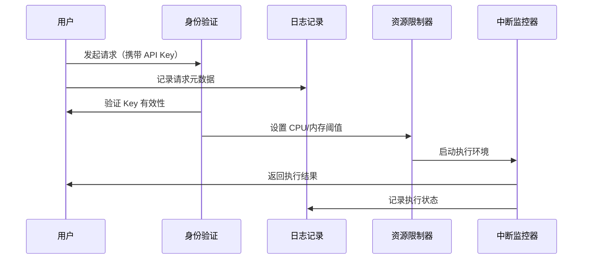

# 项目架构

yaa 智能体是前后端分离的，前端使用 HTML + CSS + JS，后端使用 Python。

## 构思

### 前端

提供用户界面，存储会话历史、存储配置、存储提示词。

### 后端

智能体实现、工具使用（函数调用）实现、运行会话、缺省时提供默认配置、缺省时提供默认提示词。

#### 工具调用安全机制



<!-- #### 后端代码结构



```mermaid
%% yaa 后端代码结构图
classDiagram
    class BaseAgent {
        
    }
``` -->

### 整体架构图

用户在前端输入指示或对会话进行修改后，前端将当前会话通过 API 发送至后端；
后端在验证密钥通过后，将会话中缺省的配置和缺省的预设提示词补全后传入新建的智能体实例；
智能体实例根据指示或对会话进行修改后，将修改后的会话返回给前端；

```mermaid
%% yaa 智能体框架架构图
flowchart TD
    subgraph FRONTEND[前端]
        HIST[会话历史和状态] --> |读取| FE[用户界面]
        FE --> |创建任务| SESSIONER[会话交互管理器]
        SESSIONER --> |保存| HIST[会话历史和状态]
        FE --> |配置| CFG[配置管理]
        FE --> |定义| PROMPT[提示词库]
    end

    subgraph BACKEND[后端]
        SESSIONER --> |会话历史、用户指示和密钥| AUTH{密钥是否合规？}
        AUTH --> |是，创建智能体实例| TASK{分析并确定任务目标}
        AUTH --> |否，返回错误| SESSIONER
        AUTO_RETRY --> |否| BREAKER
        BREAKER --> |会话历史和中断类型| SESSIONER
        AGENT --> |实时同步状态（流式传输）| SESSIONER

        subgraph AGENT[智能体]
            TASK --> PROMPT_GEN[提示词生成组合器]
            PROMPT_GEN -->|提示词| API_SERVICE[大语言模型 API]
            API_SERVICE --> |API 出错| AUTO_RETRY{是否自动重试？}
            AUTO_RETRY --> |是| API_SERVICE
            API_SERVICE -->|流式响应| TOOL_DETECTOR{是否调用工具函数？}
            TOOL_DETECTOR -->|是| APPROVE{是否已由用户自动授权？}
            TOOL_DETECTOR --> |否| FINISH_DETECTOR{是否完成任务？}
            FINISH_DETECTOR --> |是| BREAKER{中断管理}
            FINISH_DETECTOR --> |否| BREAKER{中断管理}
            APPROVE --> |是| TOOL_EXEC[工具执行器]
            APPROVE --> |否| BREAKER
            TOOL_EXEC -->|工具结果| PROMPT_GEN
        end
    end
```

### 数据结构

#### 会话

会话主要包含三个部分：

- 属性：
  - 编号：用于唯一标识会话。
  - 标题（可选，缺省值由大模型根据消息内容配合提示词生成）：用于向用户展示会话的主题。
  - 开始时间（可选，缺省值取当前格林尼治时间）：记录会话的开始时间。
  - 会话类型：如`聊天`、`代码`、`文档`等。
- 消息：一般包含智能体消息、系统错误消息、用户发送的消息、大模型的回复消息等。
  - 角色：如`智能体`、`用户`、`系统`等。
  - 内容：消息的内容。
- 配置（可选，缺省值使用默认配置）：包含 yaa 的配置信息（如覆盖系统默认提示词、最大上下文长度等软件设置）和大模型的配置信息（如 API、密钥、名称、模型参数）等。
  - 提示词：如函数调用的提示词模板、系统信息的提示词模板等。

```json
{
    "id": "string",
    "title": "string",
    "start_time": "string",
    "type": "string",
    "messages": [
        {
            "role": "string",
            "content": "string"
        },
        {
            "role": "string",
            "content": "string"
        }
    ],
    "config": {
        "yaa" : {"stream": "bool"},
        "llm_api": {
            "provider": {
                "api_url": "string",
                "api_key": "string",
                "model_name": "string",
                "model_type": {
                    "is_function_call": "bool",
                    "is_reasoning": "bool"
                },
                "cost_per_ktoken": "float",
                "cost_unit": "string",
                "max_tokens": "int",
                "model_settings": {
                    "use_costum_temp": "bool",
                    "temperature": "float"
                },
            },
            "stream": "bool",
            "request_timeout": "int",
            "interval": "int",
            "retry": {
                "times": "int",
                "delay": "int"
            }
        },
        "prompt": {
            "function": "string",
            "another_function": "string"
        }
    }
}
```
