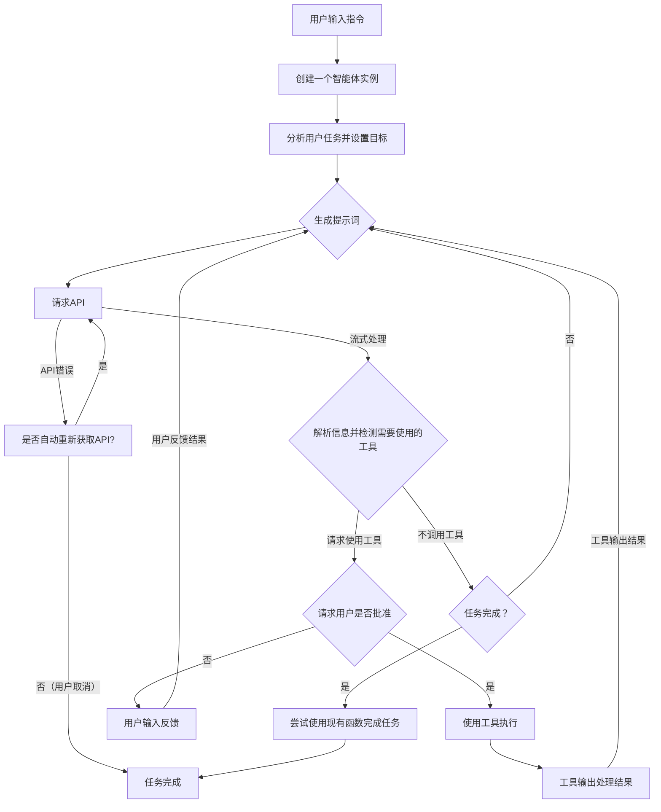

# Roo Code 的工作流程图

```mermaid
flowchart TD
    IN[用户输入指令] -->A[创建一个智能体实例]
    A --> B[分析用户任务并设置目标]
    B --> C{生成提示词}
    C --> D[请求API]
    D -->|流式处理| E{解析信息并检测需要使用的工具}
    D --> |API错误|I[是否自动重新获取API?]
    I --> |否（用户取消）|H[任务完成]
    I --> |是|D
    E --> |不调用工具|F{任务完成？}
    E --> |请求使用工具|J{请求用户是否批准}
    F --> |是|G[尝试使用现有函数完成任务]
    F --> |否|C
    G --> H
    J -->|否|M[用户输入反馈]
    M --> |用户反馈结果|C
    J -->|是| K[使用工具执行]
    K --> L[工具输出处理结果]
    L -->|工具输出结果| C
```
