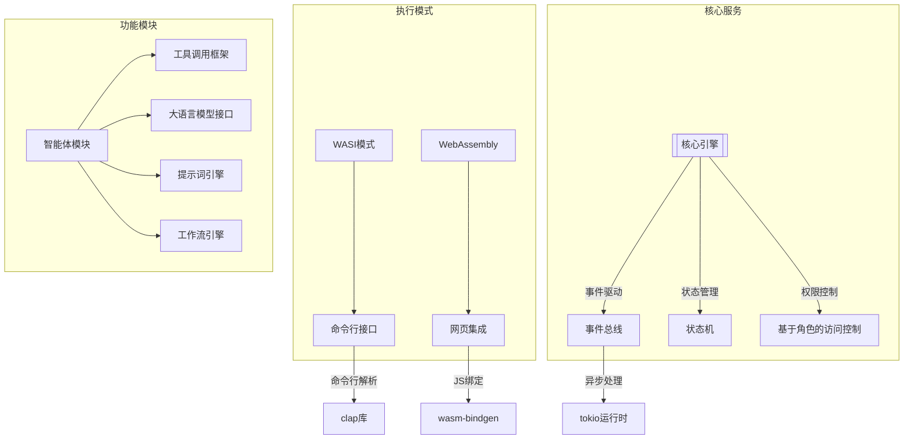

# Rust 迁移技术方案

## 架构设计



## 关键依赖矩阵

| 功能领域         | 主要依赖库                 | 版本要求   | 功能说明                    |
|------------------|---------------------------|------------|---------------------------|
| **WASM支持**     | wasm-bindgen              | ^0.2.87    | JS互操作基础库             |
|                  | js-sys                    | ^0.3.64    | JS类型系统映射            |
| **WASI支持**     | wasmtime                  | ^10.0.1    | 运行时环境                |
|                  | wasi-common               | ^10.0.1    | WASI标准实现              |
| **异步运行时**   | tokio                     | ^1.32.0    | 异步运行时（全功能特性）  |
| **HTTP服务**     | axum                      | ^0.6.20    | Web框架                  |
|                  | hyper                     | ^0.14.27   | HTTP协议实现             |
| **工具调用**     | deno_core                 | ^0.243.0   | V8隔离沙箱               |
|                  | sysinfo                   | ^0.29.10   | 资源监控                 |
| **数据处理**     | serde                     | ^1.0.188   | 序列化框架               |
|                  | serde_json                | ^1.0.107   | JSON处理                 |
| **配置管理**     | config                    | ^0.13.3    | 多格式配置支持           |
| **错误处理**     | thiserror                 | ^1.0.50    | 错误定义                 |
| **日志追踪**     | tracing                   | ^0.1.37    | 分布式追踪               |
|                  | tracing-subscriber        | ^0.3.17    | 日志订阅                 |

## 代码结构规范

```bash
src/
├── main.rs              # 模式分发入口
├── lib.rs               # 核心模块导出
├── engine/              # 核心引擎
│   ├── mod.rs           # 引擎初始化
│   ├── event.rs         # 事件总线实现
│   └── state_machine.rs # 状态机逻辑
├── agent/               # 智能体实现
│   ├── mod.rs           # 智能体主逻辑
│   ├── tools/           # 工具调用框架
│   │   ├── mod.rs       # 工具执行器
│   │   ├── wasm.rs      # WASM 工具加载
│   │   └── native.rs    # 原生工具实现
│   └── llm/             # 大模型接口
│       ├── mod.rs       # 接口抽象层
│       └── openai.rs    # OpenAI 实现
├── web/                 # WASM 相关
│   ├── mod.rs           # WASM 入口
│   ├── bindings.rs      # JS 绑定
│   └── worker.rs        # Web Worker 支持
└── cli/                 # 命令行模式
    ├── mod.rs           # CLI 入口
    └── commands.rs      # 子命令实现
```

## 核心实现策略

### 跨模式兼容层

```rust
// 统一接口定义
pub trait AgentRuntime {
    async fn init(config: &Config) -> Result<Self>;
    async fn process(&mut self, session: SessionData) -> Result<SessionData>;
    async fn stream(&self) -> impl Stream<Item = Result<Chunk>>;
}

// WASM实现
#[wasm_bindgen]
impl AgentRuntime for WebRuntime {
    // ... 浏览器环境特定实现
}

// CLI实现
impl AgentRuntime for NativeRuntime {
    // ... 命令行环境实现
}
```

### 工具调用沙箱

```rust
pub async fn execute_wasm_tool(
    wasm_bytes: &[u8],
    params: Value
) -> Result<Value> {
    let mut config = Config::new();
    config.async_support(true);
    config.wasm_backtrace_details(WasmBacktraceDetails::Enable);
    config.static_memory_maximum_size(0);
    config.dynamic_memory_guard_size(4 * 1024 * 1024);

    let engine = Engine::new(&config)?;
    let mut store = Store::new(&engine, ());
    let module = Module::from_binary(&engine, wasm_bytes)?;
    
    // 实例化并执行...
}
```

### 流式传输优化

```rust
pub struct StreamingChannel {
    inner: Arc<Mutex<StreamingInner>>,
}

impl StreamingChannel {
    pub fn new() -> (Self, impl Stream<Item = Result<Chunk>>) {
        let (tx, rx) = mpsc::channel(100);
        let inner = Arc::new(Mutex::new(StreamingInner { tx }));
        (Self { inner }, ReceiverStream::new(rx))
    }

    pub async fn send(&self, chunk: Chunk) -> Result<()> {
        let lock = self.inner.lock().await;
        lock.tx.send(Ok(chunk)).await?;
        Ok(())
    }
}
```

## 迁移路线图

1. **阶段一（1周）**：
   - 搭建基础框架
   - 实现会话数据结构
   - WASM绑定基础功能

2. **阶段二（2周）**：
   - 完成工具调用框架
   - 实现授权引擎
   - 集成大模型接口

3. **阶段三（1周）**：
   - 实现工作流引擎
   - 完成监控模块
   - 压力测试

4. **阶段四（1周）**：
   - 安全审计
   - 性能优化
   - 文档完善
