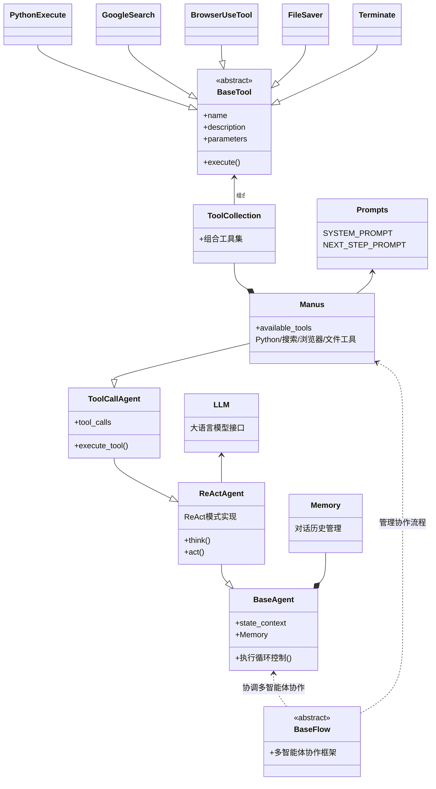

# OpenManus 的智能体框架架构图

```mermaid
%% OpenManus 智能体框架架构图
classDiagram
    direction BT

    class BaseAgent {
        +state_context
        +Memory
        +执行循环控制()
    }

    class ReActAgent {
        +think()
        +act()
        ReAct模式实现
    }

    class ToolCallAgent {
        +tool_calls
        +execute_tool()
    }

    class Manus {
        +available_tools
        Python/搜索/浏览器/文件工具
    }

    class BaseTool {
        <<abstract>>
        +name
        +description
        +parameters
        +execute()
    }

    class PythonExecute
    class GoogleSearch
    class BrowserUseTool
    class FileSaver
    class Terminate

    class ToolCollection {
        +组合工具集
    }

    class Memory {
        对话历史管理
    }

    class LLM {
        大语言模型接口
    }

    class Prompts {
        SYSTEM_PROMPT
        NEXT_STEP_PROMPT
    }

    class BaseFlow {
        <<abstract>>
        +多智能体协作框架
    }

    BaseAgent <|-- ReActAgent
    ReActAgent <|-- ToolCallAgent
    ToolCallAgent <|-- Manus

    BaseTool <|-- PythonExecute
    BaseTool <|-- GoogleSearch
    BaseTool <|-- BrowserUseTool
    BaseTool <|-- FileSaver
    BaseTool <|-- Terminate

    Manus *-- ToolCollection
    BaseAgent *-- Memory
    ReActAgent --> LLM
    Manus --> Prompts

    ToolCollection "组合" --> BaseTool

    BaseFlow ..> BaseAgent: 协调多智能体协作
    BaseFlow ..> Manus: 管理协作流程
```
